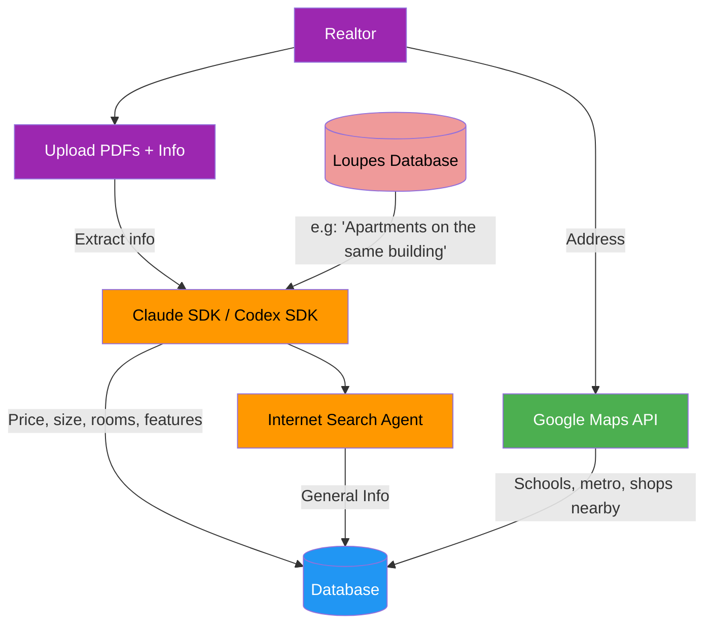
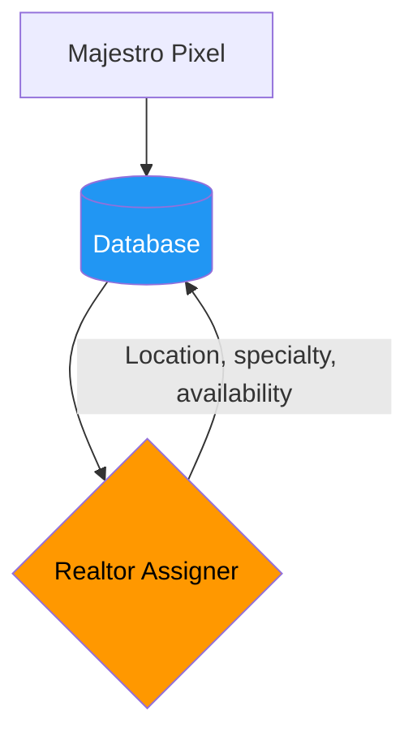
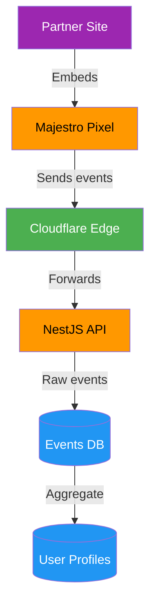
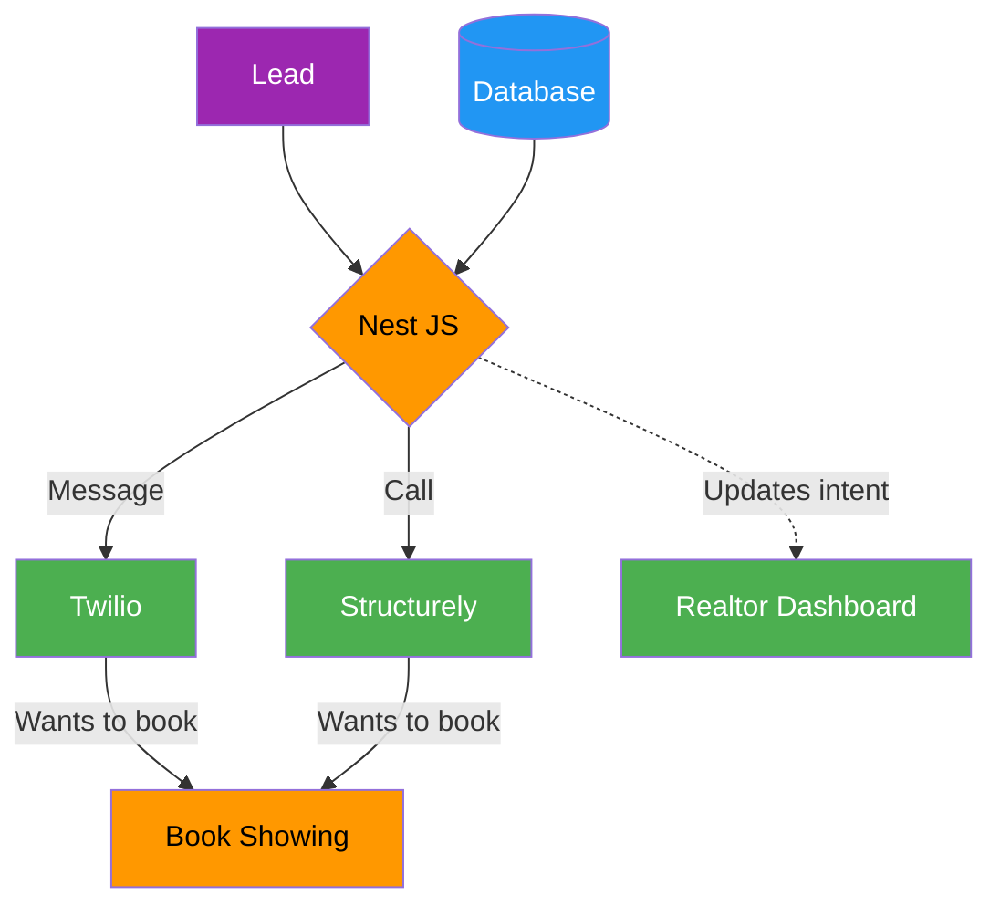
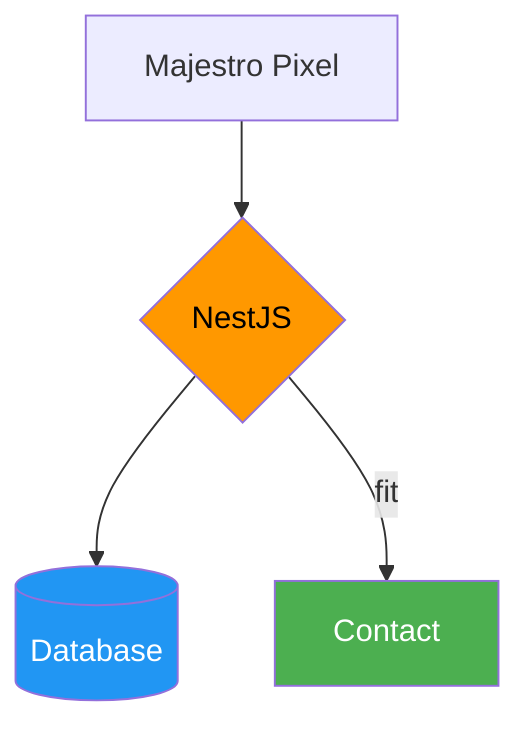
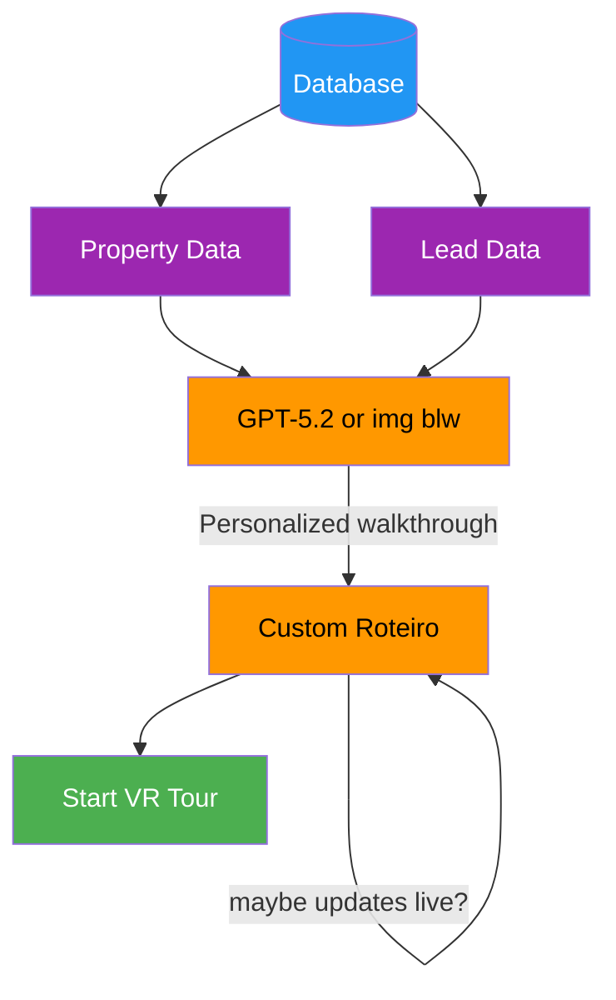
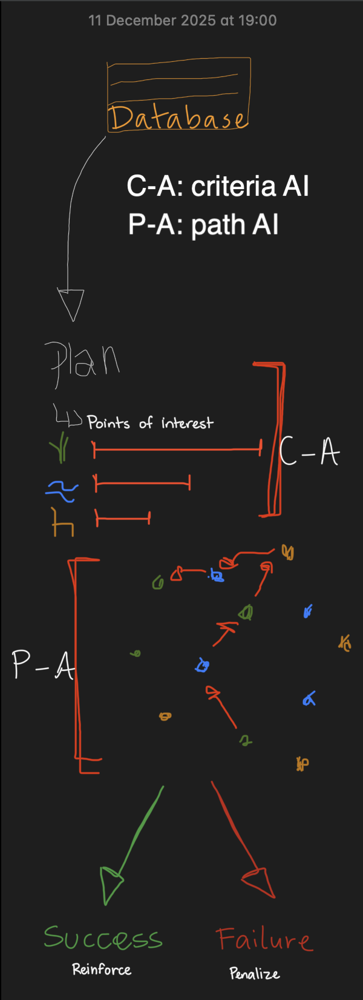

# MVP Majestro Lead Flow System Design

## 1. Entry Points

### 1.1 New Property



### 1.2 New Lead



### 1.3 Majestro Pixel



---

## 2. Processing

### 2.1 Lead Communication

**AI Chatbot/Calling (WhatsApp):**
- [Convin AI](https://convin.ai)
- [Roof AI](https://roofai.com)
- [Structurely](https://structurely.com)
- [Twilio](https://twilio.com)
- [Plaza](https://www.useplaza.com.br/)




### 2.2 First Contact Lead



---

## 3. Optimal Roteiro

**AI Engine:** [GPT-5.2](https://evals.openai.com/gdpval/leaderboard) — 60.0% wins • 77.8% wins+ties





---

# 4. Insights

After property showing, the system analyzes realtor performance by comparing the planned Roteiro against actual behavior.

## 4.1 Roteiro Adherence Analysis

**Question:** Did the realtor follow the personalized Roteiro?

| Metric | What We Track |
|--------|---------------|
| **Script Completion** | % of recommended talking points covered |
| **Order Followed** | Did they show rooms in optimal sequence? |
| **Key Highlights** | Were the lead's priority features emphasized? |
| **Objection Handling** | Did they address predicted objections? |
| **Time Allocation** | Time spent on each area vs. recommended |

## 4.2 Deviation Analysis

**Question:** When the realtor went off-script, did it help or hurt?

```
Deviation Score = (Deals Closed with Deviation) / (Total Deviations)

Compare against:
- Realtor's baseline close rate
- Network average close rate
- Close rate when Roteiro followed exactly
```

## 4.3 Realtor Improvement Recommendations

**Question:** What could the realtor do to become better?

The system generates personalized coaching based on patterns:

| Pattern Detected | Recommendation |
|------------------|----------------|
| Frequently skips objection handling | "Practice addressing price concerns upfront" |
| Rushes through property features | "Slow down — leads need 2+ min per room" |
| Misses lead's priority features | "Review lead profile before showings" |
| Poor close rate on luxury properties | "Consider shadowing top luxury closer" |
| High engagement but low conversion | "Work on closing techniques" |

## 4.4 Realtor Partnership Decision

**Question:** Should Loupes continue to work with this realtor?

## 4.5 Roteiro Effectiveness Analysis

**Question:** What parts of the Roteiro didn't work?

Not all failures are realtor failures, sometimes the AI-generated Roteiro was wrong.

---

## Color Legend

| | Meaning |
|--|---------|
| 🟣 | **Input** — Entry points, data sources, user actions |
| 🟠 | **AI/Processing** — Claude, GPT, NestJS, orchestration logic |
| 🟢 | **Output/Action** — External services, APIs, final actions |
| 🔵 | **Storage** — Database |
| 🔴 | **External Data** — Loupes Database |